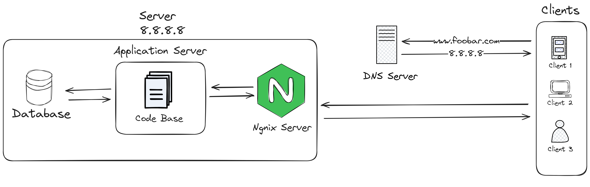

# 0-simple_web_stack

## Requirements:
- 1 server
- 1 web server (Nginx)
- 1 application server
- 1 application files (your code base)
- 1 database (MySQL)
- 1 domain name foobar.com configured with a www record that points to your server IP 8.8.8.8

## Issues with this Infrastructure :
- Single Point of Failure (SPOF):
The infrastructure has a single server, which introduces a potential single point of failure.
If the server goes down, the entire website becomes inaccessible.

- Downtime During Maintenance:
When maintenance is needed, such as deploying new code that requires restarting the web server,
there may be downtime during the restart.

- The current infrastructure may struggle to handle a large amount of incoming traffic.
implementing load balancing, and having a microservices structure might help with scaling.

## Questions :
- Server: is a computer or system that provides services or resources to other computers (clients), over a network.
In this case, the server hosts the web infrastructure.

- The role of the domain name (www.foobar.com) is to provide a human-readable alias for the server's IP address (8.8.8.8).

- The DNS record for www in www.foobar.com is a CNAME (Canonical Name) record.

- The role of the web server (Nginx) is to handle incoming HTTP requests and serve static content to users.
It can also act as a reverse proxy to forward dynamic requests to the application server.

- The application server hosts the application codebase. It processes dynamic content, executes business logic,
and communicates with other parts of the infrastructure, such as the database.

- The role of the database (MySQL) is to store and manage the website's data.
It can be queried and updated by the application server based on user requests.

- The server communicates with the user's computer using the HTTP protocol.