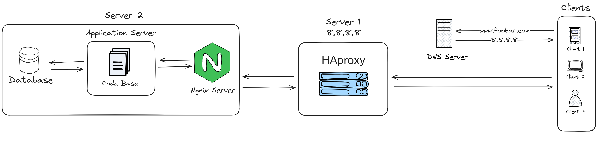

# 1-distributed_web_infrastructure

## Requirements:
- 2 servers
- 1 web server (Nginx)
- 1 application server
- 1 load-balancer (HAproxy)
- 1 set of application files (your code base)
- 1 database (MySQL)

## Issues with this Infrastructure :
- Single Points of Failure (SPOFs):
    The Load Balancer can be a single point of failure.
    If it goes down, the entire website becomes inaccessible.
- Security issues (no firewall, no HTTPS):
    The infrastructure has no firewall.
    This exposes the servers to security threats.
    The website also does not use HTTPS, which is a security risk.
- No monitoring:
    There is no monitoring configured for the infrastructure.
    This means that it will be difficult to debug issues or to pinpoint performance bottlenecks.

## Questions :
Why added a load balancer?
- Load balancing distributes traffic across multiple servers.
    This helps with redundancy (no single point of failure), and with scaling the infrastructure to handle larger amounts of traffic.
    a load balancer can also help with security by offloading some tasks to the load balancer, such as filtering traffic by IP.

What distribution algorithm your load balancer is configured with and how it works ?
- The load balancer is configured with a round-robin algorithm.
    This means that it will distribute traffic evenly across the servers.
    Other algorithms include least connections and least response time.
    Least connections will prioritize servers with fewer active connections.
    Least response time will prioritize servers with the lowest average response time.

Is your load-balancer enabling an Active-Active or Active-Passive setup, explain the difference between both ?
- The load balancer is configured with an Active-Passive setup.
    This means that only one server will be active at any given time.
    The passive server will only become active if the active server goes down.
    An Active-Active setup would have both servers active at the same time.

How a database Primary-Replica (Master-Slave) cluster works ?
- The primary-replica cluster consists of two servers.
    The primary server is the main server that handles all the database operations.
    The replica server is a backup server that can take over if the primary server goes down.
    The replica server is synchronized with the primary server to ensure it has the same data.
    The replica server can also be used to handle read-only traffic, such as SELECT queries.

What is the difference between the Primary node and the Replica node in regard to the application ?
- The primary node is the main server that handles all the database operations.
    The replica node is a backup server that can take over if the primary server goes down.
    The replica node is synchronized with the primary node to ensure it has the same data.
    The replica node can also be used to handle read-only traffic, such as SELECT queries.