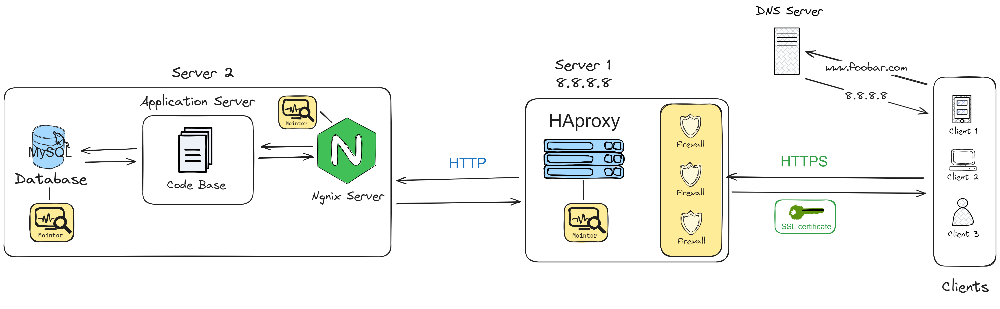

# 2-secured_and_monitored_web_infrastructure

## Requirements:
- 3 firewalls
- 1 SSL certificate to serve www.foobar.com over HTTPS
- 3 monitoring clients (data collector for Sumologic or other monitoring services)

## Issues with this Infrastructure :
- Single Points of Failure (SPOFs):
    The Load Balancer can be a single point of failure.
    If it goes down, the entire website becomes inaccessible.
- SSL termination at the load balancer level is an issue because it means that the traffic between the load balancer and the web servers is not encrypted.
- Having only one MySQL server capable of accepting writes is an issue because it means that the database is a single point of failure.
- Having servers with all the same components (database, web server and application server) might be a problem because it means that if one component goes down, the entire server goes down.

## Questions :
Why add a monitoring server?
- A monitoring server is used to collect data about the infrastructure.
    This data can be used to debug issues, to identify performance bottlenecks, and to plan for scaling.

why add a firewall?
- A firewall is used to filter traffic to and from the servers.
    This helps with security by blocking unwanted traffic, such as DDoS attacks.

Why add a SSL certificate?
- SSL certificate is used to serve the website over HTTPS.
    This helps with security by encrypting the traffic between the server and the user's computer.

why is the traffic served over HTTPS?
- serving the traffic over HTTPS helps with security by encrypting the traffic between the server and the user's computer.

Why terminating SSL at the load balancer level is an issue?
- Terminating SSL at the load balancer level is an issue because it means that the traffic between the load balancer and the web servers is not encrypted.
This means that if an attacker gains access to the network, they can intercept the traffic between the load balancer and the web servers.

Why having only one MySQL server capable of accepting writes is an issue?
- Having only one MySQL server capable of accepting writes is an issue because it means that the database is a single point of failure.

Why having servers with all the same components (database, web server and application server) might be a problem?
- Having servers with all the same components might be a problem because it means that if one component goes down, the entire server goes down.
also, it means that the servers are not optimized for their specific roles.

what to do if you want to monitor your web server QPS?
- To monitor the web server QPS, you can use a monitoring tool such as Datadog.
    This tool can be configured to collect data about the web server, such as the number of requests per second.

how the monitoring tool is collecting data?
- The monitoring tool is collecting data by running a monitoring client on each server.
    This client collects data about the server, such as CPU usage, memory usage, and disk usage.
    The agent then sends this data to the monitoring tool, which can be used to visualize the data and to set up alerts.
